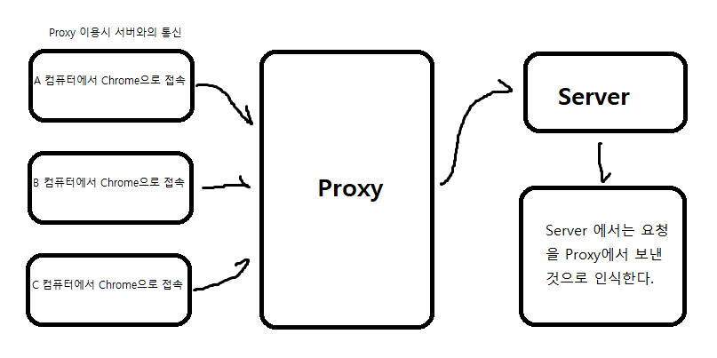

# proxy란

- 위키백과 왈 클라이언트가 자신을 통해서 다른 네트워크 서비스에 간접적으로 접속할 수 있게 해주는 컴퓨터 시스템이나 응용 프로그램

- 서버와 클라이언트 사이에 중간 과정이다.

- proxy는 무엇을 하는가?
  - 클라이언트가 서버에 요청을 보낼 때 중간에 자신이(proxy) 가로채서 자신이(proxy) 보낸 것처럼 서버에 요청을 보낸다.
- VPN << 우회 프로그램, proxy와 비슷한 개념이다.
- 서버에 요청 시에 자신의(클라이언트, 사용자) 데이터를 숨길 수 있다.

- EX) 대형마트 : 서버 | A : 실제 클라이언트, 브라우저 등등 | B, C, D 친구가 proxy
  - 대형 마트에서 계란 한정 판매 세일을 진행한다.(한판에 천원, 한명만)
  - 4명의 친구가 해당 대형마트에서 쇼핑을 하고있었다.
  - A라는 친구가 계란에 미쳐서 여러판을 사고 싶어한다.
  - B, C, D 친구가 자신의 이름으로 계란을 사서 A라는 친구에게 주고 돈을 받았다.
  - B, C, D 친구들은 대형마트를 속이고 자신이 계란을 산 것처럼했다.
  - B, C, D 가 산 계란은 실제로 A가 산 것이다.

   

---

# Reverse Proxy

- Proxy와 반대 역할을 하는 기능이다.
- 요청을 보낼 때(클라이언트)가 아닌 요청을 받은 후(서버)에 처리한다.
- 서버가 요청을 받은 후 다른 서버에 요청을 보내서 응답을 받고, 해당 응답을 자신(A)가 응답하는 것처럼 클라이언트에 응답한다.

- EX)
  1. 대학원생이 열심히 논문을 준비했지만 해당 논문은 규수가 자신의 이름으로 발표를 하게 된다.
     - 대학원생은 위에서의 B 서버이고 교수는 A 서버이다. 발표를 듣게 되는 사람들은 클라이언트이다.
     - 클라이언트 입장에서는 해당 정보는 A 서버가 보낸 응답으로 인식한다.
  2. 어떤 사람이 기부단체에 익명으로 기부를 했다. 기부금으로 지원금을 받은 사람은 기부 단체에서 준 돈인줄 알게 된다.
     -
